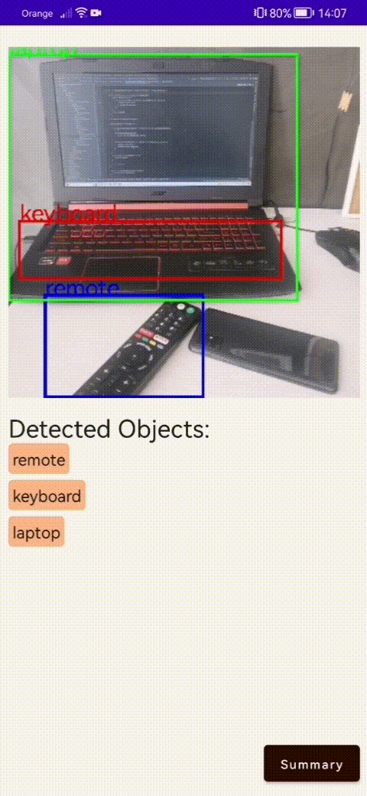

# IntelliScan

**IntelliScan** utilizes advanced technology to scan images 
using the device's camera. I leverage the TensorFlow library to detect and 
identify various objects within the scanned image. Once these objects are identified, 
I provided a feature that allows communication with Chat GPT through an API.
You can easily gain inspiration, knowledge, or 
suggestions on how to utilize these items effectively.


&nbsp;

Technology Stack:
* **Jetpack Compose**
* **CameraX**
* **OpenAi Client**
* **TensorFlow**
* **Hilt**

with MVI architecture.


## Image Detection
App uses free [TensorFlow object detection model](https://www.tensorflow.org/lite/examples/object_detection/overview?hl=pl)

All image analysis happens in **TensorFlowAnalyzer** class which implements **ImageAnalysis.Analyzer** interface

```kotlin
private val model = SsdMobilenetV11Metadata1.newInstance(context)

private val imageProcessor = ImageProcessor.Builder()
    .add(ResizeOp(
    300,
    300,
    ResizeOp.ResizeMethod.BILINEAR ))
    .build()
...
val tensorImage = TensorImage.fromBitmap(bitmap).also { image ->
    imageProcessor.process(image)
}

val outputs = model.process(tensorImage)
...     
```
For every frame from phone's camera there is created **outputs** with data from image analysis.

The **outputs** object contains information about all items detected on every frame and their position what is later used for drawing rectangles in canvas.

List of detected items is passed to ViewModel, which contains **mutableMap** of **Jobs** where item names are keys.

```kotlin
private val visibleObjects = mutableMapOf<String, Job>()
```
Every item has its job which is responsible for deleting item from map if it is no longer detected
```kotlin
 objects.forEach { newObject ->
    val isThereJobToRemoveObject = visibleObjects.keys.contains(newObject)

    if(isThereJobToRemoveObject)
        visibleObjects[newObject]?.cancel()

    visibleObjects[newObject] = viewModelScope.launch {
        delay(3000)
        removeOldObject(newObject)
    }
}
```

## GPT Api
When items are detected user can look through summary of all items and delete unwanted ones.
Then he can ask **Gpt** from OpenAi in what creative way those items can be connected.
```kotlin
@OptIn(BetaOpenAI::class)
override suspend fun askGpt(prompt: String): Resource<String> {
    try {
        val request = ChatCompletionRequest(
            model = ModelId("gpt-3.5-turbo"),
            messages = listOf(
                ChatMessage(
                    role = ChatRole.User,
                    content = prompt
                )
            )
        )
        val completion: ChatCompletion = openAI.chatCompletion(request)
        val response = completion.choices.first().message?.content
        
        return if(!response.isNullOrEmpty())
            Resource.Success(response)
        else
            Resource.Error("Ups... Something went wrong")

    } catch (e: Exception) {
        return if(!e.message.isNullOrEmpty())
            Resource.Error(e.message!!)
        else{
            Resource.Error("Ups... Something went wrong")
        }
    }
}
```
**openAI** object is provided by **Hilt**:
```kotlin
@Module
@InstallIn(SingletonComponent::class)
object OpenAiModule {

    @Provides
    @Singleton
    fun provideOpenAIApiKey(): String = BuildConfig.GPT_API_KEY

    @Provides
    @Singleton
    fun provideOpenAiClient(api_key: String): OpenAI = OpenAI(api_key)
    
}

@Module
@InstallIn(ViewModelComponent::class)
abstract class RepositoryModule {

    @ViewModelScoped
    @Binds
    abstract fun bindGPTRepository(
        repository: GPTRepositoryImpl
    ): GPTRepository

}
```
